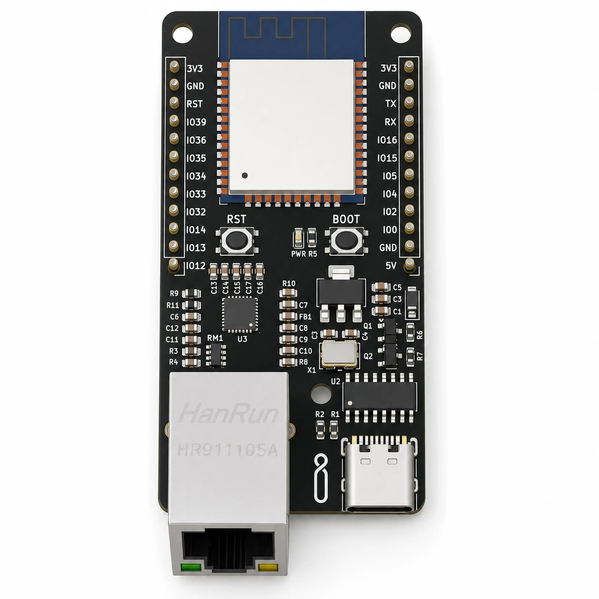
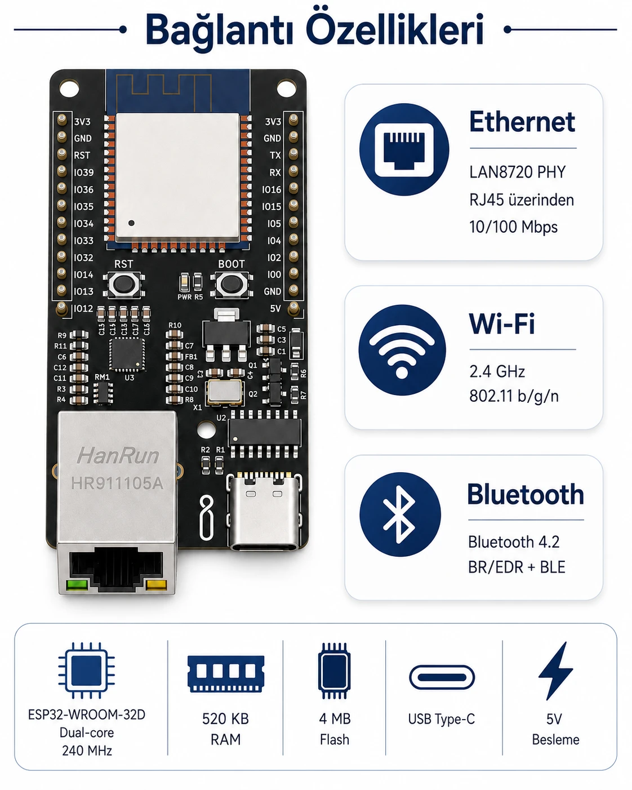
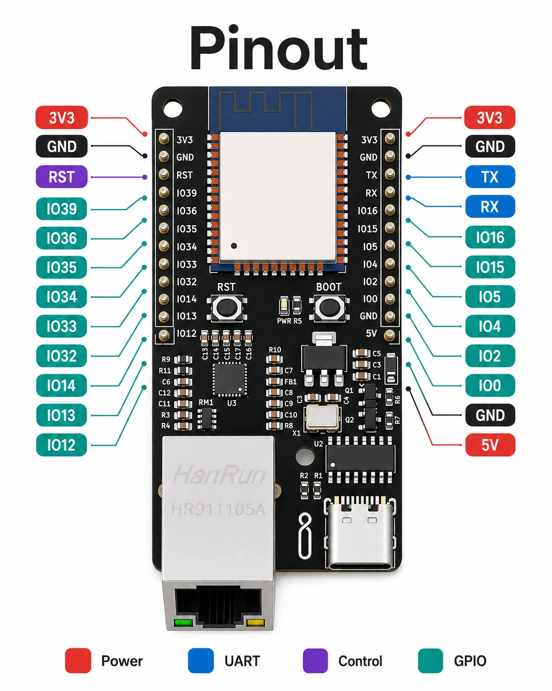

# ESP32 Ethernet Devboard

[English](README.en.md) · [Ürün sayfası](https://ilimera.com/urunler/gelistirme-kartlari/esp32-ethernet-devboard) · [Teknik doküman (PDF)](docs/ESP32_Ethernet_teknik_dokuman_v1.pdf)



İLİMERA ESP32 Ethernet Devboard; **ESP32-WROOM-32D** modülünü, **LAN8720 Ethernet PHY** ve **RJ45** portuyla
tek kartta birleştirir. Wi-Fi, Bluetooth ve 10/100 Mbps kablolu ağı aynı anda sunar; USB Type-C üzerinden
Arduino IDE veya PlatformIO ile programlanır. Endüstriyel veri toplama, bina otomasyonu, web sunuculu kontrol
ve kablolu/kablosuz ağ geçidi projeleri için tasarlanmıştır.

Bu depo kartla hemen çalışmaya başlamanız için hazır örnek kodları içerir.

## İçindekiler

- [Teknik özellikler](#teknik-özellikler)
- [Ethernet PHY pin tanımları](#ethernet-phy-pin-tanımları)
- [Kullanılabilir GPIO pinleri](#kullanılabilir-gpio-pinleri)
- [Hızlı başlangıç](#hızlı-başlangıç)
- [Örnekler](#örnekler)
- [Sık karşılaşılan sorunlar](#sık-karşılaşılan-sorunlar)
- [Destek](#destek)

## Teknik özellikler

| Özellik | Değer |
| --- | --- |
| Modül | ESP32-WROOM-32D, çift çekirdek Xtensa LX6, 240 MHz |
| Bellek | 520 KB SRAM, 4 MB SPI Flash |
| Ethernet | LAN8720 PHY, 10/100 Mbps, RJ45 (dişi) |
| Kablosuz | Wi-Fi 2.4 GHz 802.11 b/g/n, Bluetooth 4.2 BR/EDR + BLE |
| Programlama | USB Type-C (otomatik yükleme, RST ve BOOT düğmeleri) |
| Besleme | 5 V (USB Type-C veya 5V pini), kart üstü 5 V → 3.3 V regülatör |
| Geliştirme ortamı | Arduino IDE, PlatformIO |



## Ethernet PHY pin tanımları

ESP32 ile LAN8720 arasındaki bağlantılar kart üzerinde sabittir. Ethernet kütüphanesine bu değerler **birebir**
girilmelidir; aksi hâlde kart IP alamaz.

| Parametre | Değer |
| --- | --- |
| PHY tipi | `ETH_PHY_LAN8720` |
| PHY adresi | `1` |
| MDC | GPIO 23 |
| MDIO | GPIO 18 |
| Saat sinyali | `ETH_CLOCK_GPIO17_OUT` (GPIO 17 çıkış) |
| Güç pini | `-1` (kullanılmıyor) |

ESP32 Arduino çekirdeğinin iki ana sürümünde `ETH.begin` parametre sırası farklıdır. Örnekler ikisinde de
derlenecek şekilde yazılmıştır:

```cpp
#include <WiFi.h>
#include <ETH.h>

#if ESP_ARDUINO_VERSION_MAJOR >= 3   // Arduino IDE'deki güncel "esp32" paketi (3.x)
  ETH.begin(ETH_PHY_LAN8720, 1, 23, 18, -1, ETH_CLOCK_GPIO17_OUT);
#else                                // PlatformIO espressif32 platformu (2.x)
  ETH.begin(1, -1, 23, 18, ETH_PHY_LAN8720, ETH_CLOCK_GPIO17_OUT);
#endif
```

RMII veri hatları (GPIO 19, 21, 22, 25, 26, 27) ve GPIO 17, 18, 23 Ethernet'e ayrılmıştır, başka işte kullanmayın.

## Kullanılabilir GPIO pinleri



| Pinler | Not |
| --- | --- |
| IO4, IO13, IO14, IO16, IO32, IO33 | Genel amaçlı giriş/çıkış için önerilen pinler |
| IO34, IO35, IO36, IO39 | **Yalnız giriş**, dahili pull-up yok; analog ölçüm için uygun |
| IO0, IO2, IO5, IO12, IO15 | Açılış (strapping) pinleri: açılışta dışarıdan çekilmemeli. IO0 = BOOT düğmesi |
| TX, RX | USB seri hattı (Serial), program yükleme ve Seri Monitör |
| 3V3, 5V, GND | Besleme |

## Hızlı başlangıç

**Arduino IDE**

1. **Dosya → Tercihler → Ek kart yöneticisi adresleri** alanına
   `https://espressif.github.io/arduino-esp32/package_esp32_index.json` ekleyin.
2. **Araçlar → Kart → Kart Yöneticisi**'nden **esp32** (Espressif Systems) paketini kurun.
3. **Araçlar → Kart: ESP32 Dev Module**, ardından kartın COM portunu seçin.
4. [`examples/01_Ethernet_Baglanti_Testi`](examples/01_Ethernet_Baglanti_Testi) örneğini açıp yükleyin.
5. Ethernet kablosunu takın, Seri Monitörü **115200 baud** açın: `IP adresi: 192.168.x.x` ve
   `HTTP kodu: 204` görmelisiniz.

**PlatformIO**

Depodaki [`platformio.ini`](platformio.ini) dosyasında `src_dir` satırına derlemek istediğiniz örneğin klasörünü
yazın (ör. `src_dir = examples/03_Web_Sunucu_GPIO_Kontrol`), ardından:

```bash
pio run -t upload
pio device monitor -b 115200
```

Yükleme başlamazsa **BOOT** düğmesini basılı tutup yüklemeyi başlatın, "Connecting..." yazısı görününce bırakın.

## Örnekler

| Örnek | Ne yapar |
| --- | --- |
| [01_Ethernet_Baglanti_Testi](examples/01_Ethernet_Baglanti_Testi) | DHCP ile IP alır, 10 saniyede bir HTTP GET ile internet erişimini sınar (teknik dokümandaki örnek) |
| [02_Statik_IP](examples/02_Statik_IP) | DHCP olmayan ağlar için sabit IP, ağ geçidi ve DNS ayarı |
| [03_Web_Sunucu_GPIO_Kontrol](examples/03_Web_Sunucu_GPIO_Kontrol) | Tarayıcıdan çıkış pini açma/kapama, durum sayfası ve `/durum` JSON ucu |
| [04_MQTT_Telemetri](examples/04_MQTT_Telemetri) | Ethernet üzerinden MQTT'ye telemetri yayınlar, `AC`/`KAPAT` komutlarını dinler |
| [05_Ethernet_WiFi_Yedekli](examples/05_Ethernet_WiFi_Yedekli) | Ethernet öncelikli bağlantı; kablo çıkınca Wi-Fi'ye geçer, kablo gelince geri döner |

Örneklerin başındaki **KULLANICI AYARLARI** bölümünde IP, Wi-Fi, MQTT ve pin değerlerini kendinize göre
değiştirin. `04_MQTT_Telemetri` için Kütüphane Yöneticisi'nden **PubSubClient** kurun; diğer örnekler ESP32
paketiyle gelen kütüphanelerle çalışır.

## Projeler için ipuçları

- **Ethernet ve Wi-Fi birlikte:** ESP32 trafiği varsayılan olarak en son IP alan arayüze yönlendirmeye
  eğilimlidir. İki arayüz aynı anda açıkken hangi arayüzün kullanılacağını kontrol edin ya da
  `05_Ethernet_WiFi_Yedekli` örneğindeki gibi aynı anda tek arayüz kullanın.
- **Besleme:** Wi-Fi, Bluetooth ve Ethernet birlikte çalışırken USB Type-C veya 5V pininden **en az 1 A** temiz
  güç sağlayın. Zayıf USB portları ve uzun kablolar açılışta yeniden başlamalara yol açar.
- **MAC adresi:** Ethernet MAC adresi ESP32'nin eFuse'undan türetilir ve her kartta farklıdır; `ETH.macAddress()`
  ile okuyabilirsiniz.

## Sık karşılaşılan sorunlar

| Belirti | Çözüm |
| --- | --- |
| `ETH baslatildi` var, IP gelmiyor | Kabloyu ve RJ45 üzerindeki LED'leri kontrol edin; ağda DHCP yoksa `02_Statik_IP` kullanın |
| Derlemede `ETH.begin` için "no matching function" hatası | Çekirdek sürümünüze uymayan parametre sırası; örneklerdeki `#if ESP_ARDUINO_VERSION_MAJOR` bloğunu kullanın |
| `HTTP kodu: -1` | IP var ama internet yok: ağ geçidi, DNS veya güvenlik duvarını kontrol edin |
| Kart açılışta sürekli yeniden başlıyor | Besleme yetersiz: en az 1 A veren bir kaynak ve kısa bir kablo kullanın |
| Yükleme "Connecting..." aşamasında kalıyor | BOOT düğmesini basılı tutarak yüklemeyi başlatın; USB kablosunun veri kablosu olduğundan emin olun |
| Harici devre bağlıyken kart açılmıyor | IO0, IO2, IO5, IO12, IO15 açılış pinleridir; bu pinlerden devreyi ayırın |

## Destek

Teknik doküman, güncellemeler ve destek için
[ilimera.com](https://ilimera.com/urunler/gelistirme-kartlari/esp32-ethernet-devboard).
Bir hata bulduysanız ya da öneriniz varsa bu depoda **Issue** açabilirsiniz.

ESP32 Ethernet Devboard, İLİMERA Teknoloji tarafından geliştirilmiştir.

## Lisans

Örnek kodlar [MIT lisansı](LICENSE) ile sunulur; kendi ürünlerinizde serbestçe kullanabilirsiniz.
Teknik dokümanlar ve görseller İLİMERA Teknoloji'ye aittir.
